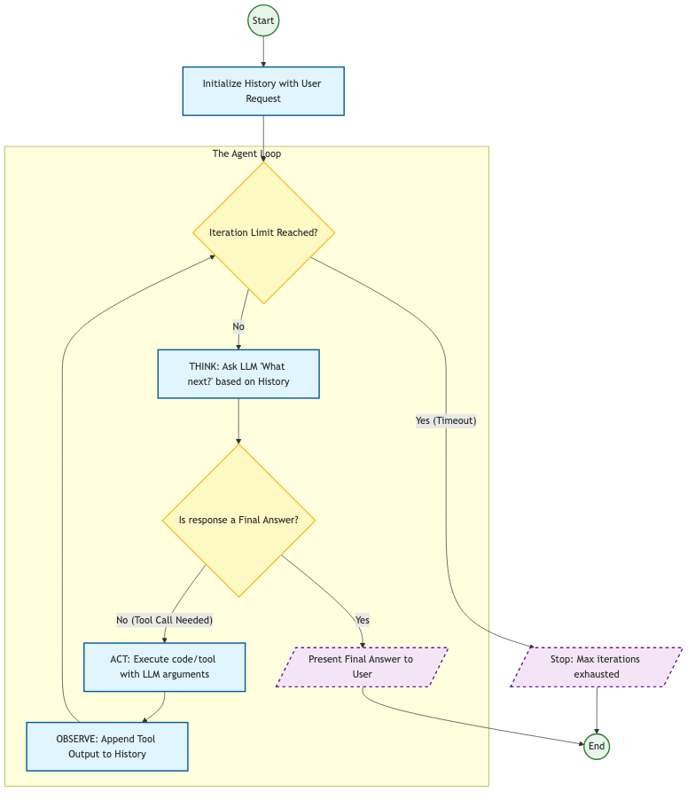

# Agents in your Terminal — Run GitHub Copilot Models in Claude Code

Use GitHub Copilot models (Claude Opus 4.6, Sonnet, GPT-5, Gemini, Grok and more) inside Claude Code CLI — all from a pre-configured Dev Container. Zero Anthropic API key needed.



---

## How It Works

```
Claude Code CLI  →  copilot-api (localhost:4141)  →  GitHub Copilot Models
```

The `copilot-api` proxy intercepts Claude Code's Anthropic API calls and routes them to GitHub Copilot's backend. Claude Code thinks it's talking to Anthropic — but it's actually using your Copilot license.

---

## Prerequisites

- **GitHub account** with [GitHub Copilot](https://github.com/features/copilot) access (Individual, Business, or Enterprise)
- **VS Code** with [Dev Containers extension](https://marketplace.visualstudio.com/items?itemName=ms-vscode-remote.remote-containers) installed
- **Docker** running locally

---

## Quick Start

### 1. Clone and Open in Dev Container

```bash
git clone https://github.com/dineshkrishna9999/agent-devcontainer-lab.git
cd agent-devcontainer-lab
```

Open the folder in VS Code, then **Reopen in Container** when prompted (or run `Dev Containers: Reopen in Container` from the Command Palette).

The Dev Container comes pre-configured with Node.js, Python, Docker-in-Docker, zsh, and more.

### 2. Install Claude Code and Copilot API

Inside the Dev Container terminal:

```bash
npm install -g @anthropic-ai/claude-code
npm install -g copilot-api
```

Verify installation:

```bash
claude --version
copilot-api --help
```

### 3. Authenticate with GitHub Copilot

```bash
copilot-api start
```

This opens a browser window for GitHub authentication. Log in with the account that has Copilot access.

### 4. Start the Proxy in Claude Code Mode

```bash
copilot-api start --claude-code
```

When prompted, select your preferred models (e.g., `claude-opus-4.6`). The proxy starts on `http://localhost:4141`.

Leave this terminal running.

### 5. Configure Claude Code Settings

Create the Claude settings file:

```bash
mkdir -p ~/.claude
cat > ~/.claude/settings.json << 'EOF'
{
  "env": {
    "ANTHROPIC_BASE_URL": "http://localhost:4141",
    "ANTHROPIC_MODEL": "claude-opus-4.6",
    "ANTHROPIC_API_KEY": "dummy"
  },
  "model": "claude-opus-4.6"
}
EOF
```

### 6. Launch Claude Code

Open a **new terminal** and run the full export command provided by `copilot-api`:

```bash
export ANTHROPIC_BASE_URL=http://localhost:4141 \
  ANTHROPIC_AUTH_TOKEN=dummy \
  ANTHROPIC_MODEL=claude-opus-4.6 \
  ANTHROPIC_DEFAULT_SONNET_MODEL=claude-sonnet-4.6 \
  ANTHROPIC_SMALL_FAST_MODEL=gpt-5-mini \
  ANTHROPIC_DEFAULT_HAIKU_MODEL=gpt-5-mini \
  DISABLE_NON_ESSENTIAL_MODEL_CALLS=1 \
  CLAUDE_CODE_DISABLE_NONESSENTIAL_TRAFFIC=1 \
  && claude
```

Claude Code is now running with GitHub Copilot models!

---

## Available Models

| Model | Provider | ID |
|-------|----------|----|
| Claude Opus 4.6 | Anthropic | `claude-opus-4.6` |
| Claude Sonnet 4.6 | Anthropic | `claude-sonnet-4.6` |
| GPT-5 mini | OpenAI | `gpt-5-mini` |
| GPT-5.1 | OpenAI | `gpt-5.1` |
| GPT-5.2 Codex | OpenAI | `gpt-5.2-codex` |
| GPT-5.3 Codex | OpenAI | `gpt-5.3-codex` |
| GPT-4o | OpenAI | `gpt-4o-2024-11-20` |
| Gemini 3.1 Pro | Google | `gemini-3.1-pro-preview` |
| Grok Code Fast 1 | xAI | `grok-code-fast-1` |

To switch models, update `settings.json` and the environment variables, then restart Claude Code.

---

## Monitor Usage

Track your Copilot API usage in the browser:

```
https://ericc-ch.github.io/copilot-api?endpoint=http://localhost:4141/usage
```

Or via the API directly:

```bash
curl http://localhost:4141/usage
```

---

## Troubleshooting

| Problem | Fix |
|---------|-----|
| Proxy not responding | Ensure `copilot-api start --claude-code` is running in a separate terminal |
| Authentication errors | Re-run `copilot-api auth` |
| Model not found | List models: `curl http://localhost:4141/v1/models` and update settings |
| Port 4141 in use | Kill the process using it: `lsof -i :4141` then restart the proxy |
| Claude asks for login | Make sure you set the environment variables before running `claude` |

---

## Project Structure

```
.
├── .devcontainer/
│   ├── Dockerfile          # Python 3.13 base image
│   ├── devcontainer.json   # Dev Container config with Node, Docker, zsh
│   └── devcontainer.env    # Environment variables
├── scripts/
│   └── post-create.sh      # Shell setup (zsh theme, history)
├── assets/
│   └── for-loop-agent.*    # Architecture diagrams
├── clean.sh                # Reset demo state
├── copilot_models_in_claude_code.md  # Quick reference notes
└── README.md               # You are here
```

---

## Credits

- [copilot-api](https://github.com/ericc-ch/copilot-api) by Eric Ch — the proxy that makes this possible
- [Rafael Medeiros](https://rafaelmedeiros94.medium.com/connecting-claude-code-to-github-copilot-models-32f42cfbfefb) — original article on connecting Claude Code to Copilot
- [Claude Code](https://code.claude.com/) by Anthropic

---

## License

MIT
