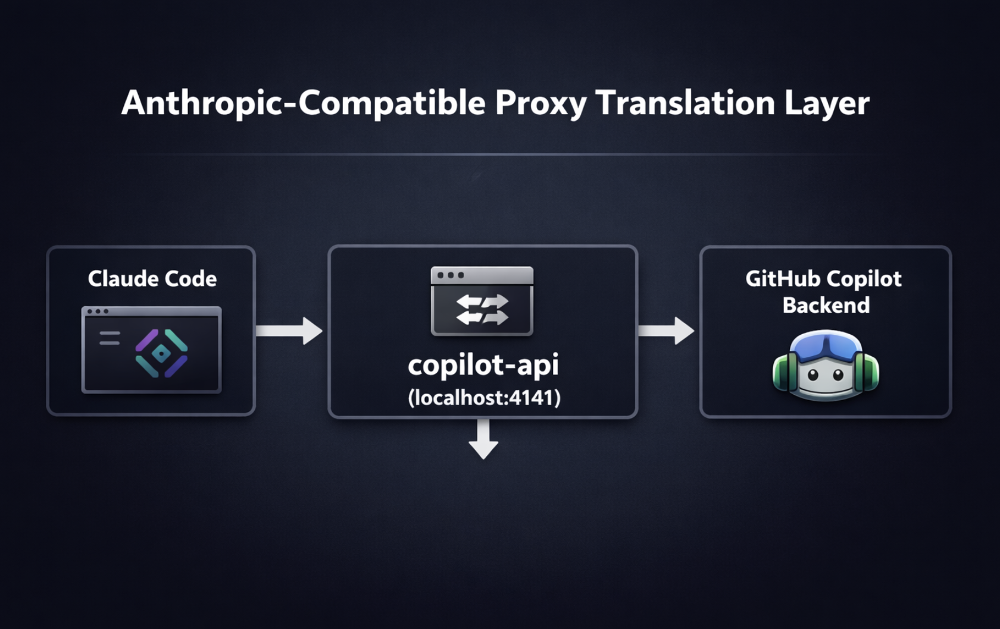

# Agents in your Terminal — Run GitHub Copilot Models in Claude Code

Use GitHub Copilot models (Claude Opus 4.6, Sonnet, GPT-5, Gemini, Grok and more) inside Claude Code CLI — all from a pre-configured Dev Container. **Zero Anthropic API key needed. Zero manual setup.**



---

## How It Works

```
Claude Code CLI  →  copilot-api (localhost:4141)  →  GitHub Copilot Models
```

The `copilot-api` proxy intercepts Claude Code's Anthropic API calls and routes them to GitHub Copilot's backend. Claude Code thinks it's talking to Anthropic — but it's actually using your Copilot license.

> Everything is pre-installed and pre-configured when the Dev Container starts. The repeatable entry points live in `pyproject.toml` as `uv run poe ...` tasks.

---

## Prerequisites

- **GitHub account** with [GitHub Copilot](https://github.com/features/copilot) access (Individual, Business, or Enterprise)
- **VS Code** with the [Dev Containers extension](https://marketplace.visualstudio.com/items?itemName=ms-vscode-remote.remote-containers) installed
- **Docker** running locally

---

## Quick Start

### 1. Clone and Open in Dev Container

```bash
git clone https://github.com/dineshkrishna9999/agent-devcontainer-lab.git
cd agent-devcontainer-lab
```

Open the folder in VS Code, then **Reopen in Container** when prompted (or run `Dev Containers: Reopen in Container` from the Command Palette).

The container automatically installs:
- `@anthropic-ai/claude-code` — the Claude Code CLI
- `copilot-api` — the Anthropic-compatible proxy
- `uv` / `uvx` — fast Python package manager
- `poethepoet` task runner via `uv sync --dev`
- Pre-configured `~/.claude/settings.json` pointing at the local proxy

Design split:
- `.devcontainer/Dockerfile` installs machine-level tools once
- `scripts/post-create.sh` keeps only user/workspace setup
- `pyproject.toml` defines the user-facing commands

### 2. Start the Proxy (authenticate once)

In the container terminal:

```bash
uv run poe proxy-start
```

This opens a browser for GitHub authentication. Log in with your Copilot-enabled account, pick a model when prompted (e.g. `claude-opus-4.6`), and leave the terminal running.

The canonical interface is the named `uv run poe ...` tasks.

### 3. Launch Claude Code

Open a **new terminal** and run:

```bash
uv run poe claude-chat
```

That's it — Claude Code is now running with GitHub Copilot models.

---

## Available Models

| Model | Provider | ID |
|-------|----------|----|
| Claude Opus 4.6 | Anthropic | `claude-opus-4.6` |
| Claude Sonnet 4.6 | Anthropic | `claude-sonnet-4.6` |
| GPT-5 mini | OpenAI | `gpt-5-mini` |
| GPT-5.1 | OpenAI | `gpt-5.1` |
| GPT-5.2 Codex | OpenAI | `gpt-5.2-codex` |
| GPT-5.3 Codex | OpenAI | `gpt-5.3-codex` |
| GPT-4o | OpenAI | `gpt-4o-2024-11-20` |
| Gemini 3.1 Pro | Google | `gemini-3.1-pro-preview` |
| Grok Code Fast 1 | xAI | `grok-code-fast-1` |

To switch models, update `~/.claude/settings.json` (`ANTHROPIC_MODEL`) and restart the proxy.

---

## Task Commands

All project entry points are defined in `/workspaces/claude-remote/pyproject.toml`.

```bash
uv run poe setup          # fallback installer for non-devcontainer runs
uv run poe proxy-auth     # auth only
uv run poe proxy-start    # auth flow + start proxy for Claude Code
uv run poe proxy-models   # list available models from the running proxy
uv run poe proxy-usage    # print usage URLs
uv run poe claude-chat    # launch Claude via scripts/start-claude.sh
uv run poe doctor         # verify core tools are installed
```

The merged helper scripts are now first-class:
- `scripts/setup.sh`: fallback installer (useful outside devcontainer)
- `scripts/start-claude.sh`: exports runtime env vars and starts Claude

## Monitor Usage

```bash
uv run poe proxy-usage
curl http://localhost:4141/usage
```

Or open the dashboard directly:
`https://ericc-ch.github.io/copilot-api?endpoint=http://localhost:4141/usage`

---

## Python / uv

`uv` is pre-installed. Use it to manage Python projects and run tools without polluting the global environment:

```bash
uv init my-project        # new project with pyproject.toml
uv add requests           # add a dependency
uvx ruff check .          # run a tool without installing it globally
uv run python script.py   # run with project venv
```

Shell completions for `uv` and `uvx` are enabled automatically.

---

## Troubleshooting

| Problem | Fix |
|---------|-----|
| Proxy not responding | Make sure `uv run poe proxy-start` is running in a separate terminal |
| Authentication errors | Re-run `copilot-api auth` |
| Model not found | `curl http://localhost:4141/v1/models` — pick an ID from the list and update `~/.claude/settings.json` |
| Port 4141 in use | `lsof -i :4141` → kill the PID, then restart the proxy |
| `claude` command not found | Rebuild the container, then run `uv run poe doctor` |

---

## Project Structure

```
.
├── .devcontainer/
│   ├── Dockerfile          # Python base image plus global Claude/Copilot CLIs
│   ├── devcontainer.json   # Node, uv, Docker-in-Docker, zsh features
│   └── devcontainer.env    # Platform env vars
├── pyproject.toml          # uv + Poe task definitions for the workspace
├── scripts/
│   ├── post-create.sh      # Syncs uv and writes user-level Claude settings
│   ├── setup.sh            # Fallback installer for non-devcontainer usage
│   └── start-claude.sh     # Claude launcher with env exports and model override
├── assets/
│   └── for-loop-agent.*    # Architecture diagrams
├── clean.sh                # Reset demo state
└── README.md               # You are here
```

---

## Credits

- [copilot-api](https://github.com/ericc-ch/copilot-api) by Eric Ch — the proxy that makes this possible
- [Rafael Medeiros](https://rafaelmedeiros94.medium.com/connecting-claude-code-to-github-copilot-models-32f42cfbfefb) — original article on connecting Claude Code to Copilot
- [Claude Code](https://code.claude.com/) by Anthropic

---

## License

MIT
